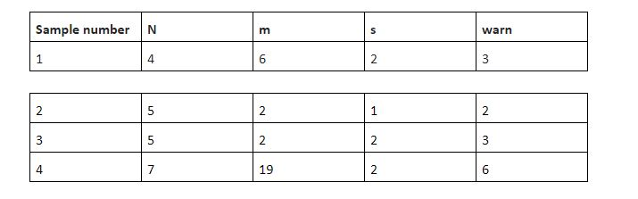
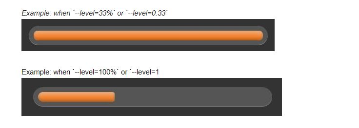

## TASK 1

A company has a number of software developers and a number of treats to pass out to them. Their HR decides the fairest way to divide the treats is to seat the developers around a circular table in sequentially numbered chairs. A chair number will be drawn from a hat. Beginning with the developer in that chair, one candy will be handed to each developer sequentially around the table until all have been distributed.

The HR is playing a little joke, though. The last piece of candy looks like all the others, but it tastes awful. Determine the chair number occupied by the developer who will receive that candy.

For example, there are 4 developers and 6 pieces of candy. The developers arrange themselves in seats numbered 1 to 4. Let's suppose two (2) is drawn from the hat. Developers receive candy at positions 2, 3, 4, 1, 2, 3. The developer to be warned sits in chair number 3. 

Function Description

Write a warnTheDeveoper function that will return an integer representing the chair number of the developer to warn. 

warnTheDeveoper(n, m, s) function has the following parameter(s):

n: an integer, the number of developer
m: an integer, the number of sweets
s: an integer, the chair number to begin passing out sweets from

Constraints 

Output Format

For each test case, print the chair number of the developer who receives the awful treats

Samples
 
Sample number

Explanation for sample number 2

In this sample, there are n = 5 developers and m = 2 sweets. Distribution starts at seat numbers = 1. Developers in seats numbered 1 and 2 get sweets. Warn developer 2. Explanation for sample number 3 

In this sample, distribution starts at seat 2 so developers in seats 2 and 3 get sweets. Warn developer 3. Explanation for sample number 4

In this test case, there are n = 7 developers, m = 19 sweets and they are passed out starting at chair s = 2. The candies go all around twice and there are more candies passed to each developer from seat 2 to seat 6.

# TASK 2

Making use of HTML and CSS only, design a progress bar as illustrated below such that one can set it’s css variable `--level` to a number between 0 and 1, or to a number between 0% and 100%, and the progress bar would reflect the level accordingly.

Note: In your solution, please indicate what range you’re working with either 0 to 1, 0% to 100% or both.

